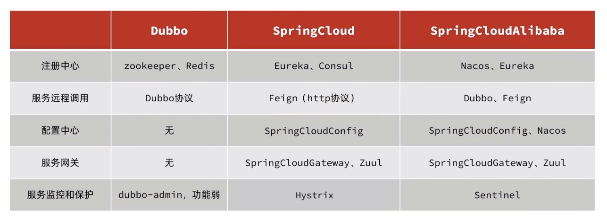
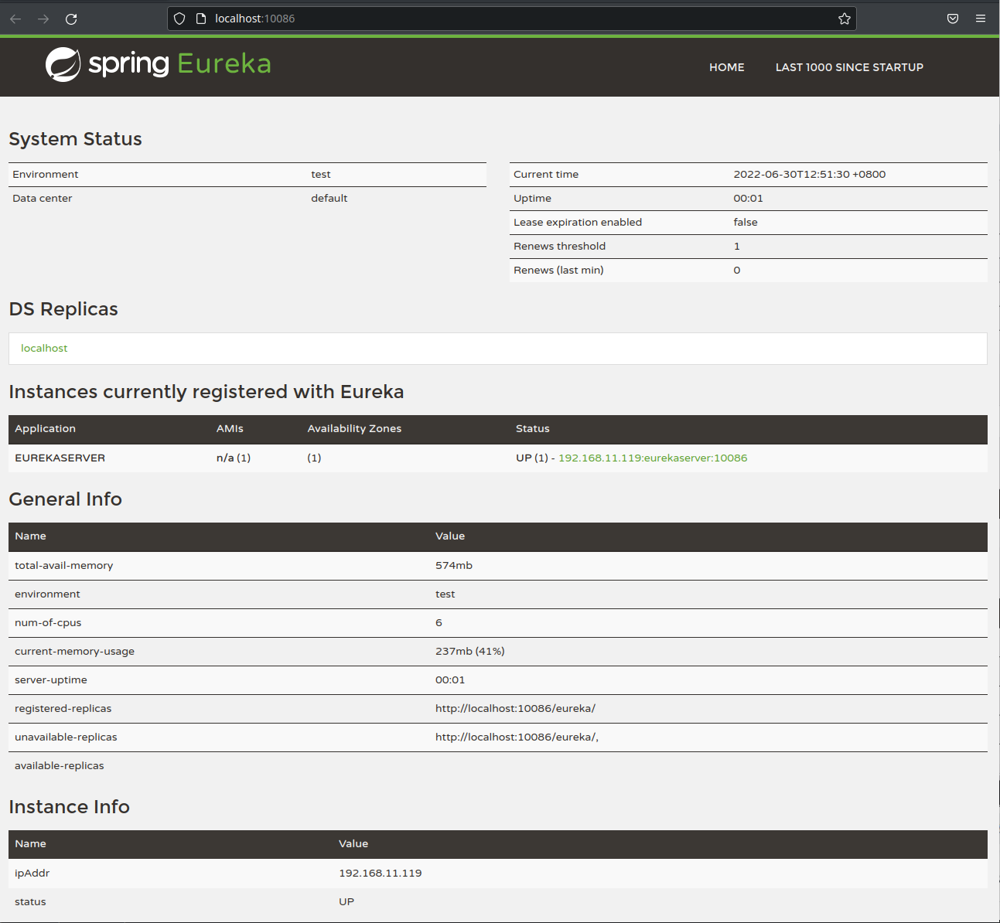
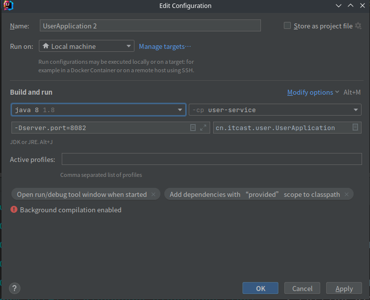
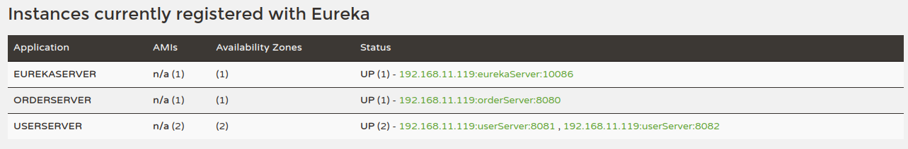
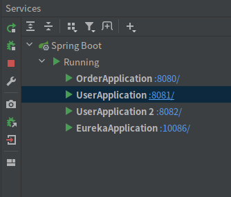
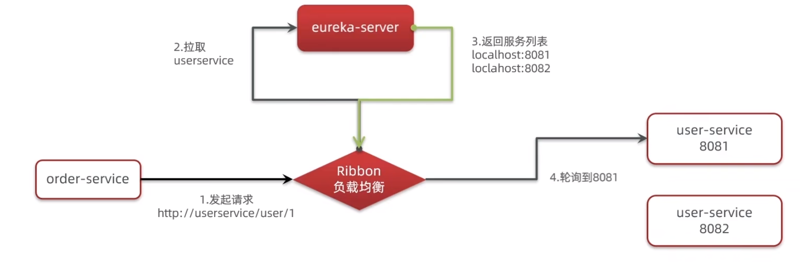
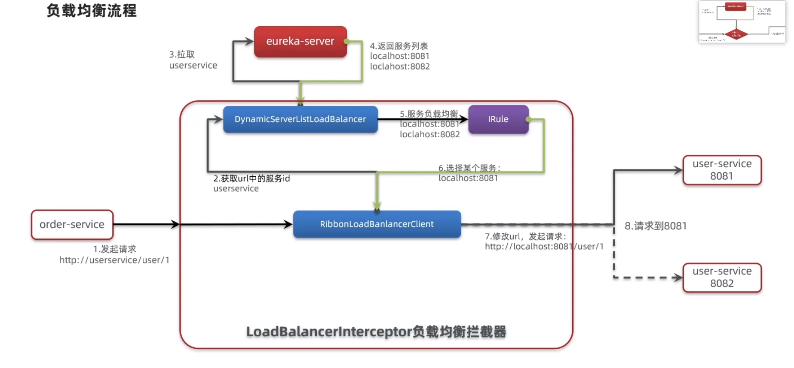
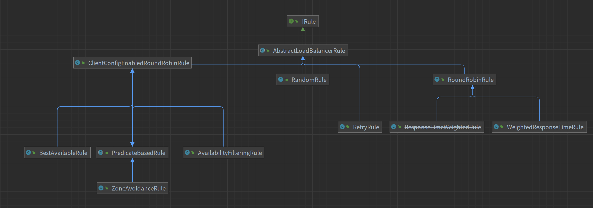

# LSpringCloud
单体项目虽然有架构简单、部署成本低的优点，但是最大的缺点就是耦合度高

## 分布式架构

根据业务功能对系统进行拆分，每个业务模块作为独立项目开发，成为一个服务

优点降低服务耦合、有利于服务升级扩展

分布式架构要考虑的问题：


微服务其实就是一种经过良好架构设计的分布式架构方案，微服务架构特征：

1. 单一职责：微服务拆分粒度更小，每一个服务都对应唯一的业务能力，做到单一职责，避免重复业务开发
2. 面向服务：微服务对外暴露业务接口
3. 自治：团队独立、技术独立、数据独立、部署独立、每个服务可以有独立的数据库，独立的数据
4. 隔离性强：服务调用做好隔离、容错、降级，避免出现级联失败

==总结==


微服务的具体框架，国内知名的就是springcloud和阿里巴巴的Dubbo

### 微服务技术对比



### 服务拆分和远程调用

1. 不用微服务，不要重复开发相同业务
2. 微服务数据独立，不要访问其它微服务的数据库
3. 微服务可以将自己的业务暴露为接口，供其他微服务使用

---

## 实例操作

### 远程调用引例

项目为黑马直接导入的一个很简单的项目，此时通过接口查询订单信息返回的user为null

所以需要使用微服务调用微服务

```http
localhost:8081/user/1
```

```json
{
    "id": 1,
    "username": "柳岩",
    "address": "湖南省衡阳市"
}
```

---

```http
localhost:8080/order/101
```

```json
{
    "id": 102,
    "price": 209900,
    "name": "雅迪 yadea 新国标电动车",
    "num": 1,
    "userId": 2,
    "user": null
}
```

目前的请求如上所示，想达到的效果如下：

```json
{
    "id": 102,
    "price": 209900,
    "name": "雅迪 yadea 新国标电动车",
    "num": 1,
    "userId": 2,
    "user": {
   	 "id": 1,
	    "username": "柳岩",
	    "address": "湖南省衡阳市"
	}
}
```

也就是将user对象整合到order中去

### RestTemplate

spring提供了RestTemplate，可以很方便的完成上面的需求

1. 首先在orderApplication中返回一个RestTemplate对象，并且将其交给springIoc容器管理
2. ```java
        @Bean
        public RestTemplate restTemplate(){
            return new RestTemplate();
        }
    ```
3. 在orderService中注入RestTemplate对象，接下来使用RestTemplate中getForObject方法将返回的json格式对象封装为一个User类型的对象在传入到Order中，最后返回Order
4. ```java
        @Autowired
        private RestTemplate restTemplate;
        public Order queryOrderById(Long orderId) {
            // 1.查询订单
            Order order = orderMapper.findById(orderId);
            // 2.利用RestTemplate发起http请求，查询用户
            String url = "http://localhost:8081/user/"+order.getUserId();
            // 2.1使用restTemplate中的getForObject请求userService获得一个json
            // 格式的user对象，然后使用restTemplate封装成一个User格式的user对象
            User user = restTemplate.getForObject(url, User.class);
    	// 3.order加入user
            order.setUser(user);
            // 4.返回
            return order;
        }
    ```
5. 在次调用`localhost:8080/order/101`
6. 返回：

    ```json
    {
        "id": 101,
        "price": 699900,
        "name": "Apple 苹果 iPhone 12 ",
        "num": 1,
        "userId": 1,
        "user": {
            "id": 1,
            "username": "柳岩",
            "address": "湖南省衡阳市"
        }
    }
    ```
7. 至此也就实现了一个简单的微服务远程调用

## 注册中心

### 提供者和消费者

* 服务提供者：一次业务中，被其他微服务调用的服务（提供接口给其他微服务）
* 服务消费者：一次业务中，调用其他微服务的服务（条用其他微服务提供的接口）

问题来了：如果A调用B,B调用了C，那么此时B是什么呢？

可以很明显的发现服务的角色是相对的，就好像运动是相对的一样

### Eureka注册中心

	有一个很严重的问题就是服务消费者如何知道服务提供者的地址，现在只是将服务提供者的地址写死在代码里面的，也就是如果加入了新的微服务，那么就要打包重新发布，这样很不好。

问题：

1. 服务消费者如何获取服务提供者的地址信息？
2. 如果有多个服务提供者，消费者该如何选择？
3. 消费者如何得知服务提供者的健康状态？

#### Eureka server

1. 每个客户端都会注册一个服务信息

    1. Eureka Server会记录下来每一个服务的信息
2. 客户端想要使用服务者提供的信息，就会来要一个“名单”

    1. 返回一个存活着的服务者的名单
3. 每个服务每隔30秒都要向server发送一个“心跳”去续约确认状态

    1. 如果一段时间没有收到一个服务期的心跳，那就会将他从名单中剔除
4. 如果有新的服务又注册上了，那么就会在名单中添加一个服务

#### Eureka client

1. 每个客户端都要注册一个服务信息
2. 客户端想要使用服务者提供的信息，就要去server要一个“名单”

    1. 如果名单上面有多个服务者，那么可以采用一些负载均衡的方式去调用
3. 客户端启动都会向server去注册

### 搭建Eureka服务

#### Eureka注册

eureka也会将自己注册到eureka上面，这是为了后面eureka集群使用的

导入依赖

```xml
        <dependency>
            <groupId>org.springframework.cloud</groupId>
            <artifactId>spring-cloud-starter-netflix-eureka-server</artifactId>
        </dependency>
```

写EurekaApplication.java

```java
//为了启动EurekaServer
@EnableEurekaServer
@SpringBootApplication
public class EurekaApplication {
    public static void main(String[] args) {
        SpringApplication.run(EurekaApplication.class,args);
    }
}
```

写application.yml

```yaml
server:
  port: 10086
spring:
  application:
    name: eurekaserver
eureka:
  client:
    service-url:
      defaultZone: http://localhost:10086/eureka
```






注册上其他的服务也是一样道理：

1. 引入eureka client依赖
2. 写好yml文件

    ```yaml
    spring:
      application:
        name: eurekaserver
    eureka:
      client:
        service-url:
          defaultZone: http://localhost:10086/eureka
    ```
3. 也可以复制实例启动，注意换端口
4. 大致效果

   

#### 服务发现和拉取

```java
public Order queryOrderById(Long orderId) {
        // 1.查询订单
        Order order = orderMapper.findById(orderId);
        // 2.利用RestTemplate发起http请求，查询用户
        // userServer也就是user服务的名称 注册中心会自动替换的
//主要就是将写死的地址换成了一个服务名称
        String url = "http://userServer/user/"+order.getUserId();
        // 2.1使用restTemplate中的getForObject请求userService获得一个json
        // 格式的user对象，然后使用restTemplate封装成一个User格式的user对象
        User user = restTemplate.getForObject(url, User.class);
        order.setUser(user);
        // 4.返回
        return order;
}
```

然后在application.java中返回RestTemplate的类中加上一个负载均衡的注解`@LoadBalanced`

```java
    @Bean
    @LoadBalanced
    public RestTemplate restTemplate(){
        return new RestTemplate();
    }
```



接下来再次访问`localhost:8080/order/101`就已经实现了负载均衡（UserApplication and UserApplication2）

#### Eureka总结

1. 搭建EurekaServer

    1. 引入eureka-server依赖
    2. 添加@EnableEurekaServer注解
    3. 在application.yml中配置服务名称和eureka地址
2. 服务注册

    1. 引入eureka-client依赖
    2. 在application.yml中配置服务名称和eureka地址
3. 服务发现

    1. 引入eureka-client依赖
    2. 在application.yml中配置服务名称和eureka地址
    3. 给RestTemplate添加上@LoadBalanced注解
    4. 给服务提供者的服务名称远程调用（链接里面只需要写上服务名称）

## Ribbon负载均衡

### 负载均衡原理

很明显上面的`String url = "http://userServer/user/"+order.getUserId();`中的url并不是一个真是的地址
也就是中间是东西拦截下来并且做了处理，这件事情就是Ribbon做的
它会先拦截下这个请求然后去找注册中心看看有没有这个服务名称，接下来会得到一个地址列表
然后会默认对得到的地址列表做一个轮询的处理，也就是轮流访问





### 负载均衡策略

> 一共有七种负载均衡策略

#### 轮询策略

轮询策略：RoundRobinRule，按照一定的顺序依次调用服务实例。比如一共有 3 个服务，第一次调用服务 1，第二次调用服务 2，第三次调用服务3，依次类推。
此策略的配置设置如下：

```yaml
springcloud-nacos-provider: # nacos中的服务id
  ribbon:
    NFLoadBalancerRuleClassName: com.netflix.loadbalancer.RoundRobinRule #设置负载均衡
```

#### 权重策略

权重策略：WeightedResponseTimeRule，根据每个服务提供者的响应时间分配一个权重，响应时间越长，权重越小，被选中的可能性也就越低。
它的实现原理是，刚开始使用轮询策略并开启一个计时器，每一段时间收集一次所有服务提供者的平均响应时间，然后再给每个服务提供者附上一个权重，权重越高被选中的概率也越大。
此策略的配置设置如下：

```yaml
springcloud-nacos-provider: # nacos中的服务id
  ribbon:
    NFLoadBalancerRuleClassName: com.netflix.loadbalancer.WeightedResponseTimeRule
```

#### 随机策略

随机策略：RandomRule，从服务提供者的列表中随机选择一个服务实例。
此策略的配置设置如下：

```yaml
springcloud-nacos-provider: # nacos中的服务id
  ribbon:
    NFLoadBalancerRuleClassName: com.netflix.loadbalancer.RandomRule #设置负载均衡
```

#### 4.最小连接数策略

最小连接数策略：BestAvailableRule，也叫最小并发数策略，它是遍历服务提供者列表，选取连接数最小的⼀个服务实例。如果有相同的最小连接数，那么会调用轮询策略进行选取。
此策略的配置设置如下：

```yaml
springcloud-nacos-provider: # nacos中的服务id
  ribbon:
    NFLoadBalancerRuleClassName: com.netflix.loadbalancer.BestAvailableRule #设置负载均衡
```

#### 重试策略

重试策略：RetryRule，按照轮询策略来获取服务，如果获取的服务实例为 null 或已经失效，则在指定的时间之内不断地进行重试来获取服务，如果超过指定时间依然没获取到服务实例则返回 null。
此策略的配置设置如下：

```yaml
ribbon:
  ConnectTimeout: 2000 # 请求连接的超时时间
  ReadTimeout: 5000 # 请求处理的超时时间
springcloud-nacos-provider: # nacos 中的服务 id
  ribbon:
    NFLoadBalancerRuleClassName: com.netflix.loadbalancer.RandomRule #设置负载均衡
```

#### 可用性敏感策略

可用敏感性策略：AvailabilityFilteringRule，先过滤掉非健康的服务实例，然后再选择连接数较小的服务实例。
此策略的配置设置如下：

```yaml
springcloud-nacos-provider: # nacos中的服务id
  ribbon:
    NFLoadBalancerRuleClassName: com.netflix.loadbalancer.AvailabilityFilteringRule
```

#### 区域敏感策略

区域敏感策略：ZoneAvoidanceRule，根据服务所在区域（zone）的性能和服务的可用性来选择服务实例，在没有区域的环境下，该策略和轮询策略类似。
此策略的配置设置如下：

```yaml
springcloud-nacos-provider: # nacos中的服务id
  ribbon:
    NFLoadBalancerRuleClassName: com.netflix.loadbalancer.ZoneAvoidanceRule
```

关于ZoneAvoidanceRule是选择区域使用的，也就是如果有多个异地机房或者机架或者主机，那么服务会优先选择距离近的去使用



此处并不是无用的代码 是IRule规则的类图 一个是mermaid格式 一个是plantuml

```
classDiagram
direction BT
class AbstractLoadBalancerRule
class AvailabilityFilteringRule
class BestAvailableRule
class ClientConfigEnabledRoundRobinRule
class IRule {
&lt;&lt;Interface&gt;&gt;

}
class PredicateBasedRule
class RandomRule
class ResponseTimeWeightedRule
class RetryRule
class RoundRobinRule
class WeightedResponseTimeRule
class ZoneAvoidanceRule

AbstractLoadBalancerRule  ..&gt;  IRule 
AvailabilityFilteringRule  --&gt;  PredicateBasedRule 
BestAvailableRule  --&gt;  ClientConfigEnabledRoundRobinRule 
ClientConfigEnabledRoundRobinRule  --&gt;  AbstractLoadBalancerRule 
PredicateBasedRule  --&gt;  ClientConfigEnabledRoundRobinRule 
RandomRule  --&gt;  AbstractLoadBalancerRule 
ResponseTimeWeightedRule  --&gt;  RoundRobinRule 
RetryRule  --&gt;  AbstractLoadBalancerRule 
RoundRobinRule  --&gt;  AbstractLoadBalancerRule 
WeightedResponseTimeRule  --&gt;  RoundRobinRule 
ZoneAvoidanceRule  --&gt;  PredicateBasedRule 
```

```
@startuml

!theme plain
top to bottom direction
skinparam linetype ortho

class AbstractLoadBalancerRule
class AvailabilityFilteringRule
class BestAvailableRule
class ClientConfigEnabledRoundRobinRule
interface IRule &lt;&lt; interface &gt;&gt;
class PredicateBasedRule
class RandomRule
class ResponseTimeWeightedRule
class RetryRule
class RoundRobinRule
class WeightedResponseTimeRule
class ZoneAvoidanceRule

AbstractLoadBalancerRule           -[#008200,dashed]-^  IRule                           
AvailabilityFilteringRule          -[#000082,plain]-^  PredicateBasedRule              
BestAvailableRule                  -[#000082,plain]-^  ClientConfigEnabledRoundRobinRule 
ClientConfigEnabledRoundRobinRule  -[#000082,plain]-^  AbstractLoadBalancerRule        
PredicateBasedRule                 -[#000082,plain]-^  ClientConfigEnabledRoundRobinRule 
RandomRule                         -[#000082,plain]-^  AbstractLoadBalancerRule        
ResponseTimeWeightedRule           -[#000082,plain]-^  RoundRobinRule                  
RetryRule                          -[#000082,plain]-^  AbstractLoadBalancerRule        
RoundRobinRule                     -[#000082,plain]-^  AbstractLoadBalancerRule        
WeightedResponseTimeRule           -[#000082,plain]-^  RoundRobinRule                  
ZoneAvoidanceRule                  -[#000082,plain]-^  PredicateBasedRule              
@enduml
```

IDEA可以复制类图成为脑图或者PlantUML

关于选择负载均衡的策略还有另外一种方式就是直接在application中bean一个规则

```java
    @Bean
    public IRule randomRule(){
        return new RandomRule();
    }
```

但是一般不会这样配置，因为这样配置的话，不管在其中调用哪一个微服务那么都是采用这个配置的规则

一般都是用配置文件

```yaml
userServer: #服务的名称
  ribbon:
    NFLoadBalancerRuleClassName: com.netflix.loadbalancer.RandomRule #配置的规则
```

这种配置方式那么只针对这个特定的服务采用特定的策略

### 懒加载

#### 饥饿加载

Ribbon默认采用的是懒加载，也就是第一次访问时才会去创建LoadBalanceClient,请求时间会很长

而饥饿加载则会在项目启动时创建，降低第一次访问的耗时，通过下面的配置就可以开启饥饿配置

```yaml
ribbon:
  eager-load:
    enabled: true #开启饥饿加载
    clients: userServer #指定对userServer这个服务饥饿加载
```

如果是多个服务需要开启那么

```yaml
ribbon:
  eager-load:
    enabled: true #开启饥饿加载
    clients:  #指定对userServer这个服务饥饿加载
    - userServer
    - testServer
```
